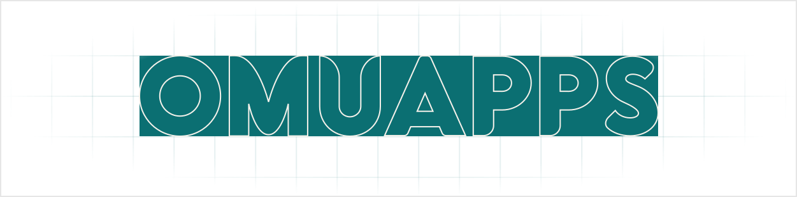

## OMUAPPSについて

OMUAPPSは、アプリ間の連携やブラウザだけでは実現できない機能を厳格に制限された権限のもと提供をするAPIアプリケーションおよびそのAPIを利用するアプリケーションを提供するプラットフォームです。

## 開発

OMUAPPSの開発環境を構築する方法です。

この手順はvscodeを使用することを前提としています。

### 必要なもの

必要なものをインストールしてください。

- Install [Rust](https://www.rust-lang.org/)
- Install [bun](https://bun.sh/)
- Install [uv](https://docs.astral.sh/uv/)

### セットアップ

`uv sync` `bun i`を実行してください。

```bash
uv sync
bun i
```

### 起動

vscodeでは、起動構成から [ Server/Client ] を選択して起動してください。
